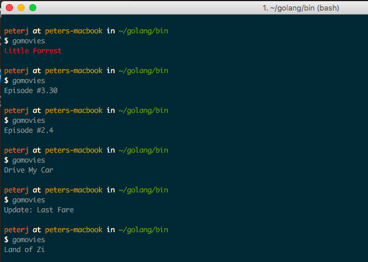

# gomovies
Get a random movie title from command line using [OMDB API](http://www.omdbapi.com/). Not much of a practical value, but good to get started with Go.



## Installation

```bash
$ go get github.com/pj3677/gomovies
```  

## Usage
Run `gomovies` or use the `Dockerfile` to build an image and run it like that.


[](https://github.com/pj3677/gomovies)